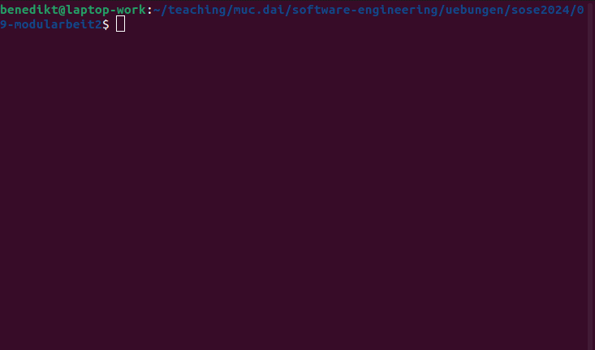

# Quiz King

## Allgemeine Hinweise zur Bearbeitung der Modularbeit

**Lesen Sie alle Beschreibungen GENAU!**:

Bitte lesen Sie alle Beschreibungen ganz genau. Sie können sich damit viel Zeit und Ärger sparen...

**Selbstständige Bearbeitung**: 

Sie bestätigen bei der Abgabe Ihres finalen Commit-Hashes in Moodle, die Modularbeit selbstständig angefertigt zu haben. 
Selbstständig heißt in diesem Zusammenhang auch, dass keine Inhalte von Large Language Models (LLM) wie ChatGPT, o.ä. generiert wurden. 
Jegliche Zweifel an der Selbstständigkeit, Nutzung von LLMs oder kopierter Code werden in mündlichen Nachprüfungen aller betroffener Abgaben geklärt.

**Vorgegebene Funktions-, Klassen- und Variablennamen**: 

Halten Sie sich unbedingt an die vorgegebenen Klassen-, Funktions- und Variablennamen. 
Ansonsten wird Ihr Code die vorgegebenen Tests nicht bestehen und Ihre Abgabe nicht gewertet.
Sie können natürlich zusätzliche Funktionen und Variablen einführen, solange die geforderten Funktionen die Funktion wie vorgegeben erfüllen. 

*Hinweis: Die Python-spezifische Notation für die unterschiedlichen Sichtbarkeiten sind im Klassendiagramm nicht angegeben. 
Sie müssen diese also entsprechend bei der Implementierung im Namen ergänzen.*

## Beschreibung der zu entwickelnden Anwendung

* Bei der zu entwickelnden Anwendung handelt es sich um ein Quiz namens Quiz King.
* Im Spiel sollen dem Spieler Wissensfragen gestellt werden.
* Zu jeder Frage gibt es vier Antwortmöglichkeiten, von denen genau eine richtig ist.
* Für jede korrekt beantwortete Frage bekommt der Spieler 100 Punkte.
* Der Spieler hat zu Beginn drei Leben.
* Beantwortet der Spieler eine Frage falsch, verliert der Spieler ein Leben und muss die gleiche Frage erneut beantworten.
* Hat der Spieler keine Leben mehr, hat er verloren.
* Die Fragen werden von der Anwendung, wenn eine Internetverbindung besteht, vom Server geladen. 
  Besteht keine Internetverbindung, lädt das Spiel die Fragen aus einer JSON-Datei.
* Zu Beginn des Spiels gibt der Spieler seinen Namen ein, sodass er persönlich angesprochen werden kann.

Folgende Abbildung zeigt den Spielverlauf einer textbasierten Lösung des Spiels (Sie können das Spiel auch mit Hilfe von customtkinter umsetzen, siehe unten).

## Benotung der Modularbeit

Die maximal erreichbare Punktzahl der Modularbeit beträgt 50 Punkte, was demnach 100% entspricht.

Die Note der Modularbeit kann nach folgendem Bewertungsschema ermittelt werden:

| bis einschließlich | Note |
|--------------------|------|
| 49%                | 5.0  |
| 54%                | 4.0  |
| 59%                | 3.7  |
| 64%                | 3.3  |
| 69%                | 3.0  |
| 74%                | 2.7  |
| 79%                | 2.3  |
| 84%                | 2.0  |
| 89%                | 1.7  |
| 94%                | 1.3  |
| 100%               | 1.0  |

Sie finden im Projekt zehn vorgegebene User Stories. 
Jede dieser User Stories hat ein `Weight`. 
Das `Weight` entspricht der Punktzahl, die Sie für die erfolgreich umgesetzte User Story bekommen.
Die folgende Tabelle zeigt die einzelnen Weights / Punkte der vorgegebenen User Stories aus Sprint 1:

| User Story Title                           | Weight / Punkte |
|--------------------------------------------|-----------------|
| Class for player's name                    | 2               |
| Class for player's score                   | 2               |
| Class for player's lives                   | 2               |
| Class for player                           | 2               |
| Class for answer                           | 2               |
| Class for question                         | 4               |
| Class for loading questions from JSON-File | 5               |
| Class for loading questions from Server    | 5               |
| Interface class question factory           | 4               |
| Text-based game application                | 7               |

Insgesamt sind somit über die vorgegebenen User Stories eine Punktzahl von 35 Punkten zu erreichen. 
Das entspricht einer 2.7, wenn alle Akzeptanzkriterien der User Stories erfüllt sind.

Die über die 35 hinausgehenden Punkte erreichen Sie, indem Sie 

* aus der Liste an User Stories aus Sprint 2 ein oder mehrere User Stories auswählen,
* mindestens eins der folgenden dynamischen Diagramme passend zu jeder ausgewählten User Story erstellen:
  * Aktivitätsdiagramm
  * Zustandsdiagramm
  * Sequenzdiagramm
* mindestens ein Klassendiagramm passend zu jeder ausgewählten User Story erstellen,
* die User Story erfolgreich umgesetzt wird.

Hier die Liste an möglichen User Stories inklusive resultierender Punktezahl:

| User Story                                        | Weight / Punkte |
|---------------------------------------------------|-----------------|
| Questions with more or less than 4 answer choices | 3               |
| Game menu                                         | 5               |
| Highscore                                         | 8               |
| Customtkinter GUI                                 | 10              |
| Questions with images                             | 8               |
| 30s Timer                                         | 8               |
| Difficulties Level                                | 4               |
| Report incorrect answers                          | 4               |

## Bearbeitung der User Stories

Sie finden in Ihrem Projekt die oben aufgeführten User Stories.
Sie müssen diese nach dem in den Übungen geübten Workflow bearbeiten.

**Wichtig:** Schauen Sie sich unbedingt, bevor Sie mit dem Arbeiten beginnen die Videos zum Thema Testing im Moodle-Kurs an! 
Hier wird die Theorie zum Thema Testing erklärt, wie `pytest` arbeitet und wie Sie es nutzen können, um Ihre Klassen auf Korrektheit zu prüfen.

Zusätzlich wurden nämlich für die User Stories in Sprint 1 bereits Unit Tests entwickelt.
Diese Unit Tests finden sie in Branches mit dem Namen `tests_...` (e.g., `tests_name`).
Wenn Sie z.B. beginnen an Klasse `Name` zu arbeiten, mergen Sie zu Beginn den Branch `tests_name` in Ihren mit Hilfe des Merge-Requests erstellten Feature-Branch.
Nun können Sie Ihre Klasse Test Driven entwickeln.

**Wichtig:** Wie in dem Video gezeigt können Sie Ihre Implementierung erst mergen, wenn alle Tests erfolgreich durchlaufen. 

Zusammengefasst sollte Ihr Vorgehen also wie folgt aussehen:

1. Merge Request inklusive Feature-Branch für User Story erzeugen
1. Branch pullen
1. Branch mit dem entsprechenden Test in den Feature-Branch mergen (für User Stories aus Sprint 1)
1. Im Feature-Branch arbeiten, regelmässig committen und pushen
1. Wenn alle Tests erfolgreich sind und Sie mit Ihrem Code zufrieden sind: Merge durchführen
1. Nächste User Story bearbeiten

**WICHTIG:** Sollten Sie auf die Idee kommen, den vorgegebenen Workflow zu ignorieren und z.B. direkt in `main` pushen, die Test-Branches nicht mergen, usw. wird die User Story von Ihrem Professor ignoriert!

**WICHTIG:** Alle Klassen werden im Ordner `src` in jeweils einer eigenen Datei implementiert. Die Dateinamen sind hin den User Stories vorgegeben. Halten Sie sich unbedingt exakt an die Dateinamen. Ansonsten schlagen die Tests fehl.

**Hinweis:** Dieser Workflow stellt sicher, wenn richtig angewendet, dass auch die User Story automatisch geschlossen wird, wenn der Merge Request durchgeführt wurde. 
Achten Sie darauf, dass dies auch wirklich der Fall ist. Ziehen Sie hierfür das Sprint Planning Board heran.

**Hinweis 2:** Sollten Sie einen Merge Request durchgeführt haben, aber noch etwas zur User Story ändern wollen, öffnen Sie die User Story erneut (reopen) und erzeugen Sie einen neuen Merge Request (inklusive branch). Fügen Sie dann Ihre Änderungen nach dem gleichen Workflow diesem Branch hinzu.

**Hinweis 3:** Sie müssen keine Docstrings für Klassen und Funktionen anlegen.

## Abgabe der Modularbeit

**Die Modularbeit ist bis zum 7.6. um 23:59:59 Uhr abzugeben.**

Sie werden am 7.6. um 23:59:59 Uhr vom `Maintainer` zum `Reporter` degradiert, d.h. Sie haben ab diesem Zeitpunkt keine Schreibrechte mehr im Projekt.
Bis dahin müssen Sie also die User Stories, die Sie bewertet haben wollen, mittels Merge Request in `main` gemerged haben.
Außerdem muss in der zugehörigen Moodle-Abgabe der Commit-Hash des letzten Merges eingetragen worden sein.

